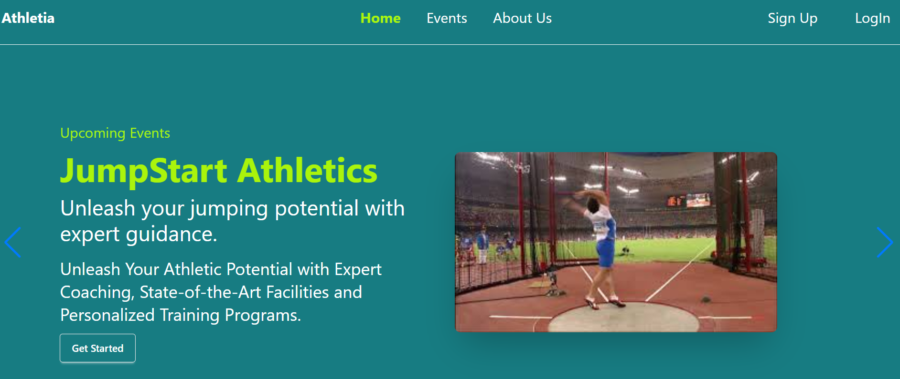

# Athletia — Athletic Event Booking Platform

## 🚀 Project Purpose

Athletia is a full-stack platform created to connect athletes and sports enthusiasts with local athletic events. It allows users to browse events, book competitions, and manage their bookings seamlessly.  
This project provides hands-on experience with user authentication, API integration, and database management.

## 🌐 Live Demo

[https://athletiausers.web.app/](https://athletiausers.web.app/)

---

## Screenshot


---

## 🔑 Key Features

- **User Authentication:** Signup, login with JWT-based secure sessions
- **Browse Events:** View detailed athletic events with schedules and locations
- **Event Booking:** Book your place for athletic competitions
- **Booking Management:** View, update, or cancel your bookings
- **Responsive Design:** Fully functional on desktop and mobile devices

---

## 🛠️ Tech Stack & NPM Packages Used

### Frontend

- React
- React Router DOM
- Axios
- Tailwind CSS
- DaisyUI

### Backend

- Node.js
- Express
- MongoDB (Mongoose)
- JSON Web Token (jsonwebtoken)
- cors
- dotenv

---

## 🛠️ Local Setup Instructions

Follow these steps to run the project locally on your machine:

### Prerequisites
- [Node.js](https://nodejs.org/en/download/) installed (v14 or above recommended)
- Git installed (optional but recommended)

### Steps

```bash
# 1️⃣ Clone the repository
git clone https://github.com/mdjosimuddin198/Athletia_booking_platform_client.git
# 2️⃣ Navigate into the project directory
cd Athletia_booking_platform_client

# 3️⃣ Install dependencies
npm install

# 4️⃣ Run the development server
npm start

```
---
## 🤝 Contributing

Feel free to fork, contribute, or give feedback!

If you'd like to contribute, please follow these steps:

1. Fork the repository

2. Create your feature branch:
```bash
git checkout -b feature/YourFeature

```
3. Commit your changes:
```bash
git commit -m 'Add some feature'
```
4.Push to the branch:
```bash
git push origin feature/YourFeature
```
5. Open a Pull Request
   
Thanks for helping improve the project! 🙌


